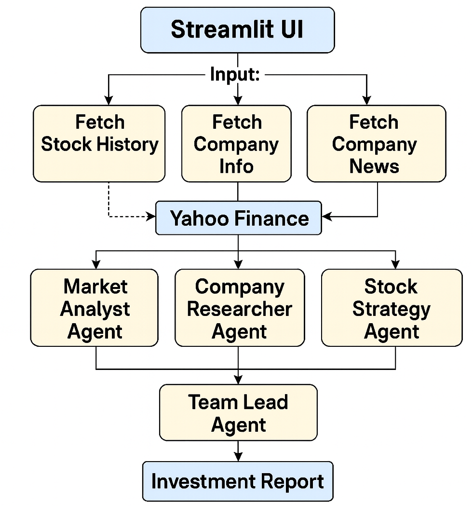

# ai-stock-advisor
## 📈🤖 AI-Powered Stock Investment Advisor


[](https://www.python.org/)  [](https://streamlit.io/)   [](https://plotly.com/python/)   [](LICENSE)   []()  

---

## 🌟 Preview


---

An interactive **Streamlit app** that analyzes stocks, researches companies, and generates **personalized investment reports** using real-time Yahoo Finance data and AI agents (Gemini via [agno](https://docs.agentops.ai/v2/integrations/agno)).

---

## 🔍 Overview

This project helps investors make smarter decisions by combining:

- **📊 Stock Market Data** → Fetched live from Yahoo Finance  
- **🧠 AI Agents** → Provide insights, summaries, and recommendations  
- **📈 Visual Analytics** → Compare returns, track correlations, and monitor performance  
- **📑 Investment Reports** → Downloadable, AI-driven recommendations in `.txt` format  

---

## 🖼️ Flow Diagram

<p align="center">
  
</p>

---

## 🎥 Demo

*A video walkthrough will be added here soon.*  

> 📌 **YouTube Link:** _Coming soon_

---

## 🚀 Features

✅ Compare stock performance over 3m, 6m, YTD, 1y, 2y  
✅ Correlation matrix of stock returns  
✅ Human-readable company market caps (e.g., `2.83T`)  
✅ Fetch latest company news (when available)  
✅ AI-powered company analysis and investment strategy (requires API key)  
✅ Download full investment reports as `.txt`  

---

## 🛠️ Tech Stack

- **Frontend**: [Streamlit](https://streamlit.io/)  
- **Data Source**: [yfinance](https://pypi.org/project/yfinance/) (Yahoo Finance)  
- **AI/LLM**: [agno](https://docs.agentops.ai/v2/integrations/agno) + [Google Gemini](https://ai.google.dev/gemini-api/docs)  
- **Visualization**: [Plotly](https://plotly.com/python/)  

---

## 📂 Project Structure

```

.
├── app.py                # Main Streamlit app
├── requirements.txt      # Dependencies
├── .env.example          # Example environment file
├── images/
│   └── block\_diagram.png # System flow diagram
└── .streamlit/
└── config.toml       # Theme settings (optional)

````

---

## ⚙️ Setup & Usage

### 1. Clone the Repo
```bash
git clone https://github.com/your-username/stock-advisor-ai.git
cd stock-advisor-ai
````

### 2. Install Requirements

```bash
pip install -r requirements.txt
```

### 3. Configure Environment

Create a `.env` file in the root directory:

```
GOOGLE_API_KEY=your_gemini_api_key
```

⚠️ The app will still run without the key (fallback mode), but AI-powered summaries and recommendations will be **disabled**.

### 4. Run the App

```bash
streamlit run app.py
```

Open your browser at: **[http://localhost:8501](http://localhost:8501)**

---

## 🧭 How It Works

1. **Input Stock Symbols** → (e.g., `AAPL, MSFT, GOOGL`)
2. **Data Fetching** → Stock history, company info, news from Yahoo Finance
3. **Agent Analysis**:

   * **Market Analyst Agent** → Compares stock performance
   * **Company Researcher Agent** → Summarizes profile + news
   * **Stock Strategy Agent** → Provides strategy & recommendations
   * **Team Lead Agent** → Compiles everything into a report
4. **Output** → Interactive dashboards + downloadable report

---

## 📌 Notes

* Works with **or without** a Google API key:

  * **With key** → Full AI insights & strategies
  * **Without key** → Still provides stock comparisons, charts, and correlation analysis
* Market cap values are converted into **human-readable formats** (e.g., `2.83T`, `530M`).
* Latest news only displays when valid titles/links are available (no broken placeholders).

---

## 📬 Feedback & Contributions

Contributions are welcome!

* Fork the repo
* Create a feature branch
* Submit a pull request 🚀

---

**Made with 💡 and ☕ by *Sushant Gautam***

